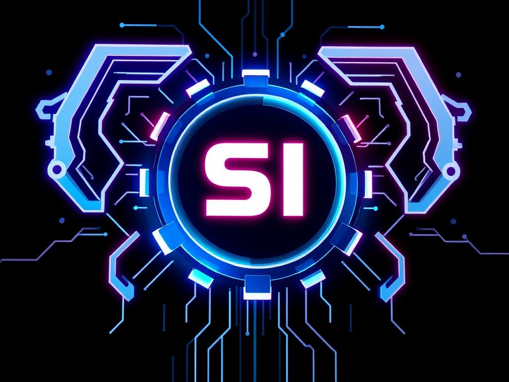

  

  

<h1 align="center">Hi 👋, I'm Sikandar Irfan</h1>

  
  
  

 

  
  

## 💫 About Me

  
  
  

    <h3>👨‍💻 Sikandar Irfan | ECE Engineer</h3>
    
Passionate about bridging the gap between hardware and software

    

    > "Let's build something amazing together!"
    

      <b>2024 Sikandar Irfan. All rights reserved. Unauthorized copying or reproduction of this profile is strictly prohibited.</b>
    

  

## 🛠️ Skills & Expertise

  
### 🔒 Security

### 💻 Systems

### 🤖 AI & ML

### 🔧 Tools

### 🧠 AI Tools

### 🔌 Hardware & Electronics

### 🛠️ Design Tools

## 🚀 Current Focus

- 🔭 Working and Learning **Advanced Ethical Hacking Projects**
- 🌱 Learning **Advanced AI/ML Techniques**
- 👯 Looking to collaborate on **Hardware & Software Projects**
- 🤝 Open to **Innovative Tech Solutions**
- 💬 Ask me about **Electronics, Hardware Design, Ethical Hacking, Linux, AI**
- 📫 Reach me at: **sikandarirfan150162@gmail.com**

## 🏆 Top Projects

  <!-- Featured Project -->
  

  <!-- Latest Repositories -->
  
  
  
  
  

## 📊 GitHub Stats

  
  

  

## 🌐 Connect with me

  
  

## 📈 Activity Graph

  

  <h2>🐍 My Contributions 🐍</h2>
   
  
  
     

  

